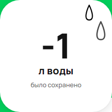

BUG_report-1 : При отправке отрицательного значения, оно отобразается в значении счетчика

Предисловие: 

1. Открыть сайт Avito - https://www.avito.ru/ 
2. Зайти во вкладку "Польза" 
3. Выбрать вкладку "Экосчетчик" 

Шаги: 

1. С помощью Charles поставить brackpoint на ресурс https://www.avito.ru/web/1/charity/ecoImpact/init
2. В настройках brackpoint установить чекбокс только на Response
3. Обновить страницу
4. Изменить параметр water = -1
   
Ожидаемый результат: Сообщение об ошибке, что отрицательных значений с единицами измерения литры, килограммы, кВт⋅ч и т.д.
Фактический результат: На странице в значении счетчика "-1"

Окружение: Яндекс браузер Версия 24.1.4.827 (64-bit)

Приоритет: high

Скриншоты : 

BUG_report-2 : Слово "тонна" не склоняется по правилам русского языка в счетчике предотвращённого объёма выброса CO2

Предисловие: 

1. Открыть сайт Avito - https://www.avito.ru/ 
2. Зайти во вкладку "Польза" 
3. Выбрать вкладку "Экосчетчик" 

Шаги: 

1. С помощью Charles поставить brackpoint на ресурс https://www.avito.ru/web/1/charity/ecoImpact/init
2. В настройках brackpoint установить чекбокс только на Response
3. Обновить страницу
4. Изменить параметр СО2 = 2000
   
Ожидаемый результат: 2 тонны CO₂ не попало в атмосферу
Фактический результат: 2 тонн CO₂ не попало в атмосферу 

Окружение: Яндекс браузер Версия 24.1.4.827 (64-bit)

Приоритет: low

Скриншоты : 

BUG_report-3 : Не происходит конвертации единиц измерения в счетчике сэкономленной электроэнергии

Предисловие: 

1. Открыть сайт Avito - https://www.avito.ru/ 
2. Зайти во вкладку "Польза" 
3. Выбрать вкладку "Экосчетчик" 

Шаги: 

1. С помощью Charles поставить brackpoint на ресурс https://www.avito.ru/web/1/charity/ecoImpact/init
2. В настройках brackpoint установить чекбокс только на Response
3. Обновить страницу
4. Изменить параметр energy = 1000000
   
Ожидаемый результат: 1 ГВт⋅ч энергии было сэкономлено
Фактический результат: 1 млн кВт⋅ч энергии было сэкономлено, так же слова из-за неправильного перевода единиц перекрывают надпись "было сэкономлено"

Окружение: Яндекс браузер Версия 24.1.4.827 (64-bit)

Приоритет: high

Скриншоты : 

BUG_report-4 : При значении счетчика > 1000000000000000 отображается едииница

Предисловие: 

1. Открыть сайт Avito - https://www.avito.ru/ 
2. Зайти во вкладку "Польза" 
3. Выбрать вкладку "Экосчетчик" 

Шаги: 

1. С помощью Charles поставить brackpoint на ресурс https://www.avito.ru/web/1/charity/ecoImpact/init
2. В настройках brackpoint установить чекбокс только на Response
3. Обновить страницу
4. Изменить параметр water = 1000000000000000

Ожидаемый результат: Например сообщение "Данное количество превышает норму"
Фактический результат: 1 л

Окружение: Яндекс браузер Версия 24.1.4.827 (64-bit)

Приоритет: high

Скриншоты : 

BUG_report-5 : Очень часто при выполнеиии тестов возникает ошибка Timeout 30000ms exceeded.

Предисловие: 

1. Открыть сайт Avito - https://www.avito.ru/ 
2. Зайти во вкладку "Польза" 
3. Выбрать вкладку "Экосчетчик" 

Шаги: 

1. Запустить тест для того чтобы сделать скриншот : 
import pytest 
import re

from playwright.sync_api import Page, expect

def test_screenshot(page: Page):        
    page.goto("https://www.avito.ru/avito-care/eco-impact")
    page.locator("desktop-impact-items-F7T6E").screenshot(path="screenshot.png")

Фактический результат: страница очень медленно загружается, иногда вообще этого не происходит 

Окружение: Яндекс браузер Версия 24.1.4.827 (64-bit)

Приоритет: medium

