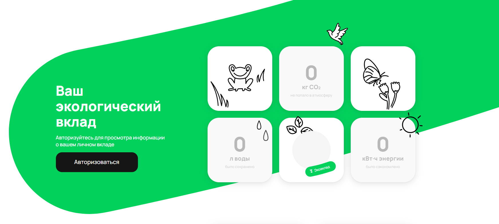
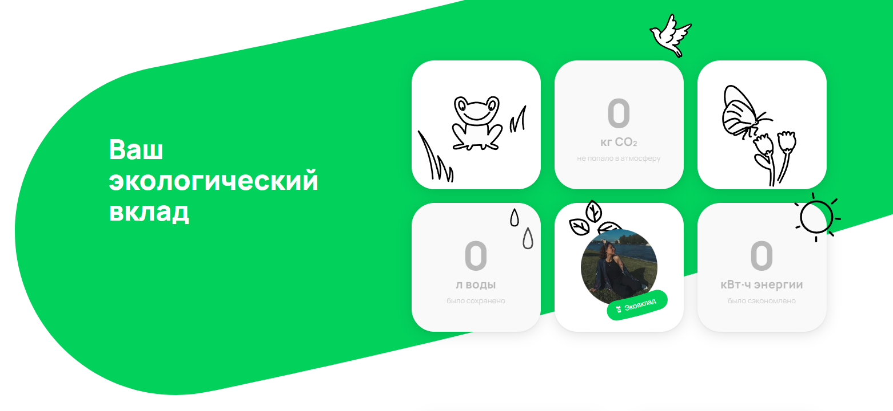

# Задача 2
## Тест - кейсы "Экосчетчик"

 ***Неавторизованный*** ***пользователь***
|№|Название|Предусловие|Окружение|Результат|
|---|---|---|---|---|
|1.|На заднем плане(фоне) расположен прямоугольник под наклоном с закругленными краями|1. Открыть сайт Avito - https://www.avito.ru/ 2. Зайти во вкладку "Польза" 3. Выбрать вкладку "Экосчетчик"|Яндекс браузер Версия 24.1.4.827 (64-bit)|PASSED|
|2.|На заднем плане(фоне) прямоугольник зеленого цвета(цвет  rgb(2, 209, 92))|1. Открыть сайт Avito - https://www.avito.ru/ 2. Зайти во вкладку "Польза" 3. Выбрать вкладку "Экосчетчик"|Яндекс браузер Версия 24.1.4.827 (64-bit)|PASSED|
|3.|Надпись "Ваш экологический вклад" расположена с выравниванием по левому краю |1. Открыть сайт Avito - https://www.avito.ru/ 2. Зайти во вкладку "Польза" 3. Выбрать вкладку "Экосчетчик"|Яндекс браузер Версия 24.1.4.827 (64-bit)|PASSED|
|4.|Размер текста надписи 48 px(font - size), тег - h1 |1. Открыть сайт Avito - https://www.avito.ru/ 2. Зайти во вкладку "Польза" 3. Выбрать вкладку "Экосчетчик"|Яндекс браузер Версия 24.1.4.827 (64-bit)|PASSED|
|5.|В надписи "Ваш экологический вклад" каждое слово расположено на каждой строке |1. Открыть сайт Avito - https://www.avito.ru/ 2. Зайти во вкладку "Польза" 3. Выбрать вкладку "Экосчетчик"|Яндекс браузер Версия 24.1.4.827 (64-bit)|PASSED|
|6.|Цвет надписи "Ваш экологический вклад" белый(#ffffff) |1. Открыть сайт Avito - https://www.avito.ru/ 2. Зайти во вкладку "Польза" 3. Выбрать вкладку "Экосчетчик"|Яндекс браузер Версия 24.1.4.827 (64-bit)|PASSED|
|7.|Надпись "Авторизуйтесь для просмотра информации о вашем личном вкладе" расположена под надписью "Ваш экологический вклад" |1. Открыть сайт Avito - https://www.avito.ru/ 2. Зайти во вкладку "Польза" 3. Выбрать вкладку "Экосчетчик"|Яндекс браузер Версия 24.1.4.827 (64-bit)|PASSED|
|8.|Надпись "Авторизуйтесь для просмотра информации о вашем личном вкладе" расположена с выравниванием по левому краю |1. Открыть сайт Avito - https://www.avito.ru/ 2. Зайти во вкладку "Польза" 3. Выбрать вкладку "Экосчетчик"|Яндекс браузер Версия 24.1.4.827 (64-bit)|PASSED|
|9.|Размер текста надписи 18 px(font - size) |1. Открыть сайт Avito - https://www.avito.ru/ 2. Зайти во вкладку "Польза" 3. Выбрать вкладку "Экосчетчик"|Яндекс браузер Версия 24.1.4.827 (64-bit)|PASSED|
|10.|Цвет надписи "Авторизуйтесь для просмотра информации о вашем личном вкладе" белый (#ffffff) |1. Открыть сайт Avito - https://www.avito.ru/ 2. Зайти во вкладку "Польза" 3. Выбрать вкладку "Экосчетчик"|Яндекс браузер Версия 24.1.4.827 (64-bit)|PASSED|
|11.|Форма кнопки - прямоугольник с закругленными краями |1. Открыть сайт Avito - https://www.avito.ru/ 2. Зайти во вкладку "Польза" 3. Выбрать вкладку "Экосчетчик"|Яндекс браузер Версия 24.1.4.827 (64-bit)|PASSED|
|12.|Цвет кнопки - #141414 |1. Открыть сайт Avito - https://www.avito.ru/ 2. Зайти во вкладку "Польза" 3. Выбрать вкладку "Экосчетчик"|Яндекс браузер Версия 24.1.4.827 (64-bit)|PASSED|
|13.|Форма кнопки - прямоугольник с закругленными краями |1. Открыть сайт Avito - https://www.avito.ru/ 2. Зайти во вкладку "Польза" 3. Выбрать вкладку "Экосчетчик"|Яндекс браузер Версия 24.1.4.827 (64-bit)|PASSED|
|14.|Форма кнопки - прямоугольник с закругленными краями |1. Открыть сайт Avito - https://www.avito.ru/ 2. Зайти во вкладку "Польза" 3. Выбрать вкладку "Экосчетчик"|Яндекс браузер Версия 24.1.4.827 (64-bit)|PASSED|
|15.|Надпись на кнопке "Авторизоваться" |1. Открыть сайт Avito - https://www.avito.ru/ 2. Зайти во вкладку "Польза" 3. Выбрать вкладку "Экосчетчик"|Яндекс браузер Версия 24.1.4.827 (64-bit)|PASSED|
|16.|Расположение текста - по центру относительно кнопки (margin: 0px) |1. Открыть сайт Avito - https://www.avito.ru/ 2. Зайти во вкладку "Польза" 3. Выбрать вкладку "Экосчетчик"|Яндекс браузер Версия 24.1.4.827 (64-bit)|PASSED|
|17.|Цвет надписи кнопки белый - #fffff  |1. Открыть сайт Avito - https://www.avito.ru/ 2. Зайти во вкладку "Польза" 3. Выбрать вкладку "Экосчетчик"|Яндекс браузер Версия 24.1.4.827 (64-bit)|PASSED|
|18.|Справа находится flexbox-сетка с 6 блоками |1. Открыть сайт Avito - https://www.avito.ru/ 2. Зайти во вкладку "Польза" 3. Выбрать вкладку "Экосчетчик"|Яндекс браузер Версия 24.1.4.827 (64-bit)|PASSED|
|19.|Блоки расположены в два ряда по 3 элемента  |1. Открыть сайт Avito - https://www.avito.ru/ 2. Зайти во вкладку "Польза" 3. Выбрать вкладку "Экосчетчик"|Яндекс браузер Версия 24.1.4.827 (64-bit)|PASSED|
|20.|Каждый блок сетки имеет размер width: 226px;height: 226px  |1. Открыть сайт Avito - https://www.avito.ru/ 2. Зайти во вкладку "Польза" 3. Выбрать вкладку "Экосчетчик"|Яндекс браузер Версия 24.1.4.827 (64-bit)|PASSED|
|21.|В первом ряду на первом элементе (1;1) изображена лягушка(по середине относительно центра ячейки) и трава(слева внизу: 3 травинки, справа по середине: 2 травинки) |1. Открыть сайт Avito - https://www.avito.ru/ 2. Зайти во вкладку "Польза" 3. Выбрать вкладку "Экосчетчик"|Яндекс браузер Версия 24.1.4.827 (64-bit)|PASSED|
|22.|Блок (2;2) - счетчик предотвращённого объёма выброса CO2  |1. Открыть сайт Avito - https://www.avito.ru/ 2. Зайти во вкладку "Польза" 3. Выбрать вкладку "Экосчетчик"|Яндекс браузер Версия 24.1.4.827 (64-bit)|PASSED|
|23.|Надпись блока (1;2) - 0(font-size: 70.129px); кг СО2(font-size: 20.72px); не попало в атмосферу (font-size: 13px; цвет #5c5c5c)  |1. Открыть сайт Avito - https://www.avito.ru/ 2. Зайти во вкладку "Польза" 3. Выбрать вкладку "Экосчетчик"|Яндекс браузер Версия 24.1.4.827 (64-bit)|PASSED|
|24.|Цвет надписи блока (1;2) - 0; кг СО2; не попало в атмосферу - #5c5c5c  |1. Открыть сайт Avito - https://www.avito.ru/ 2. Зайти во вкладку "Польза" 3. Выбрать вкладку "Экосчетчик"|Яндекс браузер Версия 24.1.4.827 (64-bit)|PASSED|
|25.|Надпись блока (1;2) - выровнена по центру  |1. Открыть сайт Avito - https://www.avito.ru/ 2. Зайти во вкладку "Польза" 3. Выбрать вкладку "Экосчетчик"|Яндекс браузер Версия 24.1.4.827 (64-bit)|PASSED|
|26.|Над правым углом блока (1;2) изображена птица(голубь), направленная клювом влево|1. Открыть сайт Avito - https://www.avito.ru/ 2. Зайти во вкладку "Польза" 3. Выбрать вкладку "Экосчетчик"|Яндекс браузер Версия 24.1.4.827 (64-bit)|PASSED|
|27.|На блоке (1;3) бабочка (над цветами)и 2 цветка |1. Открыть сайт Avito - https://www.avito.ru/ 2. Зайти во вкладку "Польза" 3. Выбрать вкладку "Экосчетчик"|Яндекс браузер Версия 24.1.4.827 (64-bit)|PASSED|
|28.|Блок(2; 1) - счетчик сохранённого объёма воды |1. Открыть сайт Avito - https://www.avito.ru/ 2. Зайти во вкладку "Польза" 3. Выбрать вкладку "Экосчетчик"|Яндекс браузер Версия 24.1.4.827 (64-bit)|PASSED|
|29.|Надпись блока (2;1) - 0(font-size: 70.129px); л воды(font-size: 20.72px); было сохранено (font-size: 13px)  |1. Открыть сайт Avito - https://www.avito.ru/ 2. Зайти во вкладку "Польза" 3. Выбрать вкладку "Экосчетчик"|Яндекс браузер Версия 24.1.4.827 (64-bit)|PASSED|
|30.|Цвет надписи блока (2;1) - 0; л воды; было сохранено - #5c5c5c  |1. Открыть сайт Avito - https://www.avito.ru/ 2. Зайти во вкладку "Польза" 3. Выбрать вкладку "Экосчетчик"|Яндекс браузер Версия 24.1.4.827 (64-bit)|PASSED|
|31.|Надпись блока (2;1) - выровнена по центру  |1. Открыть сайт Avito - https://www.avito.ru/ 2. Зайти во вкладку "Польза" 3. Выбрать вкладку "Экосчетчик"|Яндекс браузер Версия 24.1.4.827 (64-bit)|PASSED|
|32.|В правом верхнем углу блока (2;1) изображены 2 капли  |1. Открыть сайт Avito - https://www.avito.ru/ 2. Зайти во вкладку "Польза" 3. Выбрать вкладку "Экосчетчик"|Яндекс браузер Версия 24.1.4.827 (64-bit)|PASSED|
|33.|По середине блока (2; 2) расположен круг - цвет #f5f5f5, размер 134 x 134 (px)  |1. Открыть сайт Avito - https://www.avito.ru/ 2. Зайти во вкладку "Польза" 3. Выбрать вкладку "Экосчетчик"|Яндекс браузер Версия 24.1.4.827 (64-bit)|PASSED|
|34.|Внизу круга(правее) и поверх изображен прямоугольник под углом с закругленными краями, зеленого цвета (цвет  rgb(2, 209, 92)) |1. Открыть сайт Avito - https://www.avito.ru/ 2. Зайти во вкладку "Польза" 3. Выбрать вкладку "Экосчетчик"|Яндекс браузер Версия 24.1.4.827 (64-bit)|PASSED|
|35.|На прямоугольнике надпись - цветок в горшке и "Эковклад"  |1. Открыть сайт Avito - https://www.avito.ru/ 2. Зайти во вкладку "Польза" 3. Выбрать вкладку "Экосчетчик"|Яндекс браузер Версия 24.1.4.827 (64-bit)|PASSED|
|36.|Цвет надписи - #ffffff |1. Открыть сайт Avito - https://www.avito.ru/ 2. Зайти во вкладку "Польза" 3. Выбрать вкладку "Экосчетчик"|Яндекс браузер Версия 24.1.4.827 (64-bit)|PASSED|
|37.|Сверху круга(левее) изображены три листика (самый верхний немного выходит за границу блока)|1. Открыть сайт Avito - https://www.avito.ru/ 2. Зайти во вкладку "Польза" 3. Выбрать вкладку "Экосчетчик"|Яндекс браузер Версия 24.1.4.827 (64-bit)|PASSED|
|38.|Блок(2; 3) - счетчик сэкономленной электроэнергии |1. Открыть сайт Avito - https://www.avito.ru/ 2. Зайти во вкладку "Польза" 3. Выбрать вкладку "Экосчетчик"|Яндекс браузер Версия 24.1.4.827 (64-bit)|PASSED|
|39.|Надпись блока (2;3) - 0(font-size: 70.129px); кВт⋅ч энергии(font-size: 20.72px); было сэкономлено (font-size: 13px)  |1. Открыть сайт Avito - https://www.avito.ru/ 2. Зайти во вкладку "Польза" 3. Выбрать вкладку "Экосчетчик"|Яндекс браузер Версия 24.1.4.827 (64-bit)|PASSED|
|40.|Цвет надписи блока (2;1) - 0;  кВт⋅ч энергии; было сэкономлено - #5c5c5c  |1. Открыть сайт Avito - https://www.avito.ru/ 2. Зайти во вкладку "Польза" 3. Выбрать вкладку "Экосчетчик"|Яндекс браузер Версия 24.1.4.827 (64-bit)|PASSED|
|41.|Надпись блока (2;3) - выровнена по центру  |1. Открыть сайт Avito - https://www.avito.ru/ 2. Зайти во вкладку "Польза" 3. Выбрать вкладку "Экосчетчик"|Яндекс браузер Версия 24.1.4.827 (64-bit)|PASSED|
|42.|На правом верхнем углу блока (2;3) изображено солнце |1. Открыть сайт Avito - https://www.avito.ru/ 2. Зайти во вкладку "Польза" 3. Выбрать вкладку "Экосчетчик"|Яндекс браузер Версия 24.1.4.827 (64-bit)|PASSED|
|43.|Все изображения блоков выполнены контуром черного цвета |1. Открыть сайт Avito - https://www.avito.ru/ 2. Зайти во вкладку "Польза" 3. Выбрать вкладку "Экосчетчик"|Яндекс браузер Версия 24.1.4.827 (64-bit)|PASSED|
|44.|У второго ряда ячеек, у каждой (2;1)(2;2)(2;3) есть тень|1. Открыть сайт Avito - https://www.avito.ru/ 2. Зайти во вкладку "Польза" 3. Выбрать вкладку "Экосчетчик"|Яндекс браузер Версия 24.1.4.827 (64-bit)|PASSED|

***Авторизованный*** ***пользователь***
|№|Название|Предусловие|Окружение|Результат|
|---|---|---|---|---|
|1.|На заднем плане(фоне) расположен прямоугольник под наклоном с закругленными краями|1. Открыть сайт Avito - https://www.avito.ru/ 2. Зайти во вкладку "Польза" 3. Выбрать вкладку "Экосчетчик" 4. Авторизоваться |Яндекс браузер Версия 24.1.4.827 (64-bit)|PASSED|
|2.|На заднем плане(фоне) прямоугольник зеленого цвета(цвет  rgb(2, 209, 92))|1. Открыть сайт Avito - https://www.avito.ru/ 2. Зайти во вкладку "Польза" 3. Выбрать вкладку "Экосчетчик" 4. Авторизоваться|Яндекс браузер Версия 24.1.4.827 (64-bit)|PASSED|
|3.|Надпись "Ваш экологический вклад" расположена с выравниванием по левому краю |1. Открыть сайт Avito - https://www.avito.ru/ 2. Зайти во вкладку "Польза" 3. Выбрать вкладку "Экосчетчик" 4. Авторизоваться|Яндекс браузер Версия 24.1.4.827 (64-bit)|PASSED|
|4.|Размер текста надписи 48 px(font - size), тег - h1 |1. Открыть сайт Avito - https://www.avito.ru/ 2. Зайти во вкладку "Польза" 3. Выбрать вкладку "Экосчетчик"|Яндекс браузер Версия 24.1.4.827 (64-bit)|PASSED|
|5.|В надписи "Ваш экологический вклад" каждое слово расположено на каждой строке |1. Открыть сайт Avito - https://www.avito.ru/ 2. Зайти во вкладку "Польза" 3. Выбрать вкладку "Экосчетчик" 4. Авторизоваться|Яндекс браузер Версия 24.1.4.827 (64-bit)|PASSED|
|6.|Цвет надписи "Ваш экологический вклад" белый(#ffffff) |1. Открыть сайт Avito - https://www.avito.ru/ 2. Зайти во вкладку "Польза" 3. Выбрать вкладку "Экосчетчик" 4. Авторизоваться|Яндекс браузер Версия 24.1.4.827 (64-bit)|PASSED|
|7.|Справа находится flexbox-сетка с 6 блоками |1. Открыть сайт Avito - https://www.avito.ru/ 2. Зайти во вкладку "Польза" 3. Выбрать вкладку "Экосчетчик" 4. Авторизоваться|Яндекс браузер Версия 24.1.4.827 (64-bit)|PASSED|
|8.|Блоки расположены в два ряда по 3 элемента  |1. Открыть сайт Avito - https://www.avito.ru/ 2. Зайти во вкладку "Польза" 3. Выбрать вкладку "Экосчетчик" 4. Авторизоваться|Яндекс браузер Версия 24.1.4.827 (64-bit)|PASSED|
|9.|Каждый блок сетки имеет размер width: 226px;height: 226px  |1. Открыть сайт Avito - https://www.avito.ru/ 2. Зайти во вкладку "Польза" 3. Выбрать вкладку "Экосчетчик" 4. Авторизоваться|Яндекс браузер Версия 24.1.4.827 (64-bit)|PASSED|
|10.|В первом ряду на первом элементе (1;1) изображена лягушка(по середине относительно центра ячейки) и трава(слева внизу: 3 травинки, справа по середине: 2 травинки) |1. Открыть сайт Avito - https://www.avito.ru/ 2. Зайти во вкладку "Польза" 3. Выбрать вкладку "Экосчетчик" 4. Авторизоваться|Яндекс браузер Версия 24.1.4.827 (64-bit)|PASSED|
|11.|Блок (2;2) - счетчик предотвращённого объёма выброса CO2  |1. Открыть сайт Avito - https://www.avito.ru/ 2. Зайти во вкладку "Польза" 3. Выбрать вкладку "Экосчетчик" 4. Авторизоваться|Яндекс браузер Версия 24.1.4.827 (64-bit)|PASSED|
|12.|Надпись блока (1;2) - 0(font-size: 70.129px); кг СО2(font-size: 20.72px); не попало в атмосферу (font-size: 13px; цвет #5c5c5c)  |1. Открыть сайт Avito - https://www.avito.ru/ 2. Зайти во вкладку "Польза" 3. Выбрать вкладку "Экосчетчик" 4. Авторизоваться|Яндекс браузер Версия 24.1.4.827 (64-bit)|PASSED|
|13.|Цвет надписи блока (1;2) - 0; кг СО2; не попало в атмосферу - #5c5c5c |1. Открыть сайт Avito - https://www.avito.ru/ 2. Зайти во вкладку "Польза" 3. Выбрать вкладку "Экосчетчик" 4. Авторизоваться|Яндекс браузер Версия 24.1.4.827 (64-bit)|PASSED|
|14.|Надпись блока (1;2) - выровнена по центру  |1. Открыть сайт Avito - https://www.avito.ru/ 2. Зайти во вкладку "Польза" 3. Выбрать вкладку "Экосчетчик" 4. Авторизоваться|Яндекс браузер Версия 24.1.4.827 (64-bit)|PASSED|
|15.|Над правым углом блока (1;2) изображена птица(голубь), направленная клювом влево|1. Открыть сайт Avito - https://www.avito.ru/ 2. Зайти во вкладку "Польза" 3. Выбрать вкладку "Экосчетчик" 4. Авторизоваться|Яндекс браузер Версия 24.1.4.827 (64-bit)|PASSED|
|16.|На блоке (1;3) бабочка (над цветами)и 2 цветка |1. Открыть сайт Avito - https://www.avito.ru/ 2. Зайти во вкладку "Польза" 3. Выбрать вкладку "Экосчетчик" 4. Авторизоваться|Яндекс браузер Версия 24.1.4.827 (64-bit)|PASSED|
|17.|Блок(2; 1) - счетчик сохранённого объёма воды |1. Открыть сайт Avito - https://www.avito.ru/ 2. Зайти во вкладку "Польза" 3. Выбрать вкладку "Экосчетчик" 4. Авторизоваться|Яндекс браузер Версия 24.1.4.827 (64-bit)|PASSED|
|18.|Надпись блока (2;1) - 0(font-size: 70.129px); л воды(font-size: 20.72px); было сохранено (font-size: 13px)  |1. Открыть сайт Avito - https://www.avito.ru/ 2. Зайти во вкладку "Польза" 3. Выбрать вкладку "Экосчетчик" 4. Авторизоваться|Яндекс браузер Версия 24.1.4.827 (64-bit)|PASSED|
|19.|Цвет надписи блока (2;1) - 0; л воды; было сохранено - #5c5c5c  |1. Открыть сайт Avito - https://www.avito.ru/ 2. Зайти во вкладку "Польза" 3. Выбрать вкладку "Экосчетчик" 4. Авторизоваться|Яндекс браузер Версия 24.1.4.827 (64-bit)|PASSED|
|20.|Надпись блока (2;1) - выровнена по центру  |1. Открыть сайт Avito - https://www.avito.ru/ 2. Зайти во вкладку "Польза" 3. Выбрать вкладку "Экосчетчик" 4. Авторизоваться|Яндекс браузер Версия 24.1.4.827 (64-bit)|PASSED|
|21.|В правом верхнем углу блока (2;1) изображены 2 капли  |1. Открыть сайт Avito - https://www.avito.ru/ 2. Зайти во вкладку "Польза" 3. Выбрать вкладку "Экосчетчик" 4. Авторизоваться|Яндекс браузер Версия 24.1.4.827 (64-bit)|PASSED|
|22.|По середине блока (2; 2) расположен круг -  размер 134 x 134 (px)  |1. Открыть сайт Avito - https://www.avito.ru/ 2. Зайти во вкладку "Польза" 3. Выбрать вкладку "Экосчетчик" 4. Авторизоваться|Яндекс браузер Версия 24.1.4.827 (64-bit)|PASSED|
|23.|На месте круга расположена аватарка пользователя |1. Открыть сайт Avito - https://www.avito.ru/ 2. Зайти во вкладку "Польза" 3. Выбрать вкладку "Экосчетчик" 4. Авторизоваться|Яндекс браузер Версия 24.1.4.827 (64-bit)|PASSED|
|24.|Внизу круга(правее) и поверх изображен прямоугольник под углом с закругленными краями, зеленого цвета(цвет  rgb(2, 209, 92))  |1. Открыть сайт Avito - https://www.avito.ru/ 2. Зайти во вкладку "Польза" 3. Выбрать вкладку "Экосчетчик" 4. Авторизоваться|Яндекс браузер Версия 24.1.4.827 (64-bit)|PASSED|
|25.|На прямоугольнике надпись - цветок в горшке и "Эковклад"  |1. Открыть сайт Avito - https://www.avito.ru/ 2. Зайти во вкладку "Польза" 3. Выбрать вкладку "Экосчетчик" 4. Авторизоваться|Яндекс браузер Версия 24.1.4.827 (64-bit)|PASSED|
|26.|Цвет надписи - #ffffff |1. Открыть сайт Avito - https://www.avito.ru/ 2. Зайти во вкладку "Польза" 3. Выбрать вкладку "Экосчетчик" 4. Авторизоваться|Яндекс браузер Версия 24.1.4.827 (64-bit)|PASSED|
|27.|Сверху круга(левее) изображены три листика (самый верхний немного выходит за границу блока)|1. Открыть сайт Avito - https://www.avito.ru/ 2. Зайти во вкладку "Польза" 3. Выбрать вкладку "Экосчетчик" 4. Авторизоваться|Яндекс браузер Версия 24.1.4.827 (64-bit)|PASSED|
|28.|Блок(2; 3) - счетчик сэкономленной электроэнергии |1. Открыть сайт Avito - https://www.avito.ru/ 2. Зайти во вкладку "Польза" 3. Выбрать вкладку "Экосчетчик" 4. Авторизоваться|Яндекс браузер Версия 24.1.4.827 (64-bit)|PASSED|
|29.|Надпись блока (2;3) - 0(font-size: 70.129px); кВт⋅ч энергии(font-size: 20.72px); было сэкономлено (font-size: 13px)  |1. Открыть сайт Avito - https://www.avito.ru/ 2. Зайти во вкладку "Польза" 3. Выбрать вкладку "Экосчетчик" 4. Авторизоваться|Яндекс браузер Версия 24.1.4.827 (64-bit)|PASSED|
|30.|Цвет надписи блока (2;1) - 0;  кВт⋅ч энергии; было сэкономлено - #5c5c5c  |1. Открыть сайт Avito - https://www.avito.ru/ 2. Зайти во вкладку "Польза" 3. Выбрать вкладку "Экосчетчик" 4. Авторизоваться|Яндекс браузер Версия 24.1.4.827 (64-bit)|PASSED|
|31.|Надпись блока (2;3) - выровнена по центру  |1. Открыть сайт Avito - https://www.avito.ru/ 2. Зайти во вкладку "Польза" 3. Выбрать вкладку "Экосчетчик" 4. Авторизоваться|Яндекс браузер Версия 24.1.4.827 (64-bit)|PASSED|
|32.|На правом верхнем углу блока (2;3) изображено солнце |1. Открыть сайт Avito - https://www.avito.ru/ 2. Зайти во вкладку "Польза" 3. Выбрать вкладку "Экосчетчик" 4. Авторизоваться|Яндекс браузер Версия 24.1.4.827 (64-bit)|PASSED|
|33.|Все изображения блоков выполнены контуром черного цвета |1. Открыть сайт Avito - https://www.avito.ru/ 2. Зайти во вкладку "Польза" 3. Выбрать вкладку "Экосчетчик" 4. Авторизоваться|Яндекс браузер Версия 24.1.4.827 (64-bit)|PASSED|
|34.|У второго ряда ячеек, у каждой (2;1)(2;2)(2;3) есть тень|1. Открыть сайт Avito - https://www.avito.ru/ 2. Зайти во вкладку "Польза" 3. Выбрать вкладку "Экосчетчик" 4. Авторизоваться|Яндекс браузер Версия 24.1.4.827 (64-bit)|PASSED|
|35.|При изменении счетчика (отличного от нуля) цифры становятся #141414 цвета |1. Открыть сайт Avito - https://www.avito.ru/ 2. Зайти во вкладку "Польза" 3. Выбрать вкладку "Экосчетчик" 4. Авторизоваться 5. Изменить значение на счетчике с помощью Charles |Яндекс браузер Версия 24.1.4.827 (64-bit)|PASSED|

 ***Подсчет*** ***эковклада*** (авторизованного)***пользователя***

Счетчик сохраненного объева воды (water) 
|№|Название|Шаги|Ожидаемый результат|Тестовые данные|Результат|
|---|---|---|---|---|---|
|1.| Отправка отрицательного значения|1. С помощью Charles поставить brackpoint на ресурс https://www.avito.ru/web/1/charity/ecoImpact/init 2. В настройках brackpoint установить чекбокс только на Response 3. Изменить параметр water|Единицы измерения воды не могут принимать отрицательное значение|"water":-1|FAILED|
|2.| Нулевое значение счетчика воды||На счетчике значение "0 л воды" и надпись "было сохранено"|0|PASSED|
|3.|Значение счетчика воды 1 л|1. С помощью Charles поставить brackpoint на ресурс https://www.avito.ru/web/1/charity/ecoImpact/init 2. В настройках brackpoint установить чекбокс только на Response 3. Изменить параметр water |На счетчике значение "10 л воды" и надпись "было сохранено"|"water":1|PASSED|
|4.|Значение счетчика воды 10 л|1. С помощью Charles поставить brackpoint на ресурс https://www.avito.ru/web/1/charity/ecoImpact/init 2. В настройках brackpoint установить чекбокс только на Response 3. Изменить параметр water |На счетчике значение "10 л воды" и надпись "было сохранено"|"water":10|PASSED|
|5.|Значение счетчика воды 100 л|1. С помощью Charles поставить brackpoint на ресурс https://www.avito.ru/web/1/charity/ecoImpact/init 2. В настройках brackpoint установить чекбокс только на Response 3. Изменить параметр water |На счетчике значение "100 л воды" и надпись "было сохранено"|"water":100|PASSED|
|6.|Подстановка значения вместо 1000 л|1. С помощью Charles поставить brackpoint на ресурс https://www.avito.ru/web/1/charity/ecoImpact/init 2. В настройках brackpoint установить чекбокс только на Response 3. Изменить параметр water |На счетчике значение "1 метр кубический воды" и надпись "было сохранено"|"water":1000|PASSED|
|7.|Подстановка значения вместо 100 000 л|1. С помощью Charles поставить brackpoint на ресурс https://www.avito.ru/web/1/charity/ecoImpact/init 2. В настройках brackpoint установить чекбокс только на Response 3. Изменить параметр water |На счетчике значение "100 метр кубический воды" и надпись "было сохранено"|"water":100000|PASSED|
|8.|Подстановка значения вместо 1 000 000 л|1. С помощью Charles поставить brackpoint на ресурс https://www.avito.ru/web/1/charity/ecoImpact/init 2. В настройках brackpoint установить чекбокс только на Response 3. Изменить параметр water |На счетчике значение "1 тыс метр кубический воды" и надпись "было сохранено"|"water":1000000|PASSED|
|9.|Подстановка значения вместо 1 000 000 000 л|1. С помощью Charles поставить brackpoint на ресурс https://www.avito.ru/web/1/charity/ecoImpact/init 2. В настройках brackpoint установить чекбокс только на Response 3. Изменить параметр water |На счетчике значение "1 млн метр кубический воды" и надпись "было сохранено"|"water":1000000000|PASSED|
|10.|Подстановка значения вместо 1 000 000 000 000 л|1. С помощью Charles поставить brackpoint на ресурс https://www.avito.ru/web/1/charity/ecoImpact/init 2. В настройках brackpoint установить чекбокс только на Response 3. Изменить параметр water |На счетчике значение "1 млрд метр кубический воды" и надпись "было сохранено"|"water":1000000000000|PASSED|
|11.|Подстановка значения вместо 1 000 000 000 000 000 л|1. С помощью Charles поставить brackpoint на ресурс https://www.avito.ru/web/1/charity/ecoImpact/init 2. В настройках brackpoint установить чекбокс только на Response 3. Изменить параметр water ||"water":1000000000000000|SKIPPED|
|12.|Любое число в промежутке 0 <= w <1000 будет иметь вид % л воды |1. С помощью Charles поставить brackpoint на ресурс https://www.avito.ru/web/1/charity/ecoImpact/init 2. В настройках brackpoint установить чекбокс только на Response 3. Изменить параметр water |На счетчике значение "999 л воды" и надпись "было сохранено"|"water":999|PASSED|
|13.|Любое число в промежутке 1000 <= w <=10 000 будет иметь вид % метр кубический воды, если кратно 1000 |1. С помощью Charles поставить brackpoint на ресурс https://www.avito.ru/web/1/charity/ecoImpact/init 2. В настройках brackpoint установить чекбокс только на Response 3. Изменить параметр water |На счетчике значение "10 метр кубический воды" и надпись "было сохранено"|"water":10000|PASSED|
|14.|Любое число в промежутке 1000 < w < 100 000 будет округляться и иметь вид %.1f метр кубический воды |1. С помощью Charles поставить brackpoint на ресурс https://www.avito.ru/web/1/charity/ecoImpact/init 2. В настройках brackpoint установить чекбокс только на Response 3. Изменить параметр water |На счетчике значение "11,1 метр кубический воды" и надпись "было сохранено"|"water":11111|PASSED|
|15.|Любое число в промежутке 100 000 < w < 1 000 000 будет округляться до целого числа и  иметь вид % метр кубический воды |1. С помощью Charles поставить brackpoint на ресурс https://www.avito.ru/web/1/charity/ecoImpact/init 2. В настройках brackpoint установить чекбокс только на Response 3. Изменить параметр water |На счетчике значение "126 метр кубический воды" и надпись "было сохранено"|"water":125888|PASSED|
|16.|Любое число в промежутке 1 000 000 < w < 10 000 000 будет округляться и иметь вид %.1f тыс метр кубический воды |1. С помощью Charles поставить brackpoint на ресурс https://www.avito.ru/web/1/charity/ecoImpact/init 2. В настройках brackpoint установить чекбокс только на Response 3. Изменить параметр water |На счетчике значение "7,9 метр кубический воды" и надпись "было сохранено"|"water":7899000|PASSED|
|17.|Любое число в промежутке 100 000 000 < w < 1 000 000 000 будет округляться до целого числа и  иметь вид % тыс метр кубический воды |1. С помощью Charles поставить brackpoint на ресурс https://www.avito.ru/web/1/charity/ecoImpact/init 2. В настройках brackpoint установить чекбокс только на Response 3. Изменить параметр water |На счетчике значение "126 тыс метр кубический воды" и надпись "было сохранено"|"water":125888000|PASSED|
|18.|Любое число в промежутке 1 000 000 000 < w < 10 000 000 000 будет округляться и иметь вид %.1f млн метр кубический воды |1. С помощью Charles поставить brackpoint на ресурс https://www.avito.ru/web/1/charity/ecoImpact/init 2. В настройках brackpoint установить чекбокс только на Response 3. Изменить параметр water |На счетчике значение "7,9 млн метр кубический воды" и надпись "было сохранено"|"water":7899000000|PASSED|
|19.|Любое число в промежутке 100 000 000 000 < w < 1 000 000 000 000 будет округляться до целого числа и  иметь вид % тыс метр кубический воды |1. С помощью Charles поставить brackpoint на ресурс https://www.avito.ru/web/1/charity/ecoImpact/init 2. В настройках brackpoint установить чекбокс только на Response 3. Изменить параметр water |На счетчике значение "126 млн метр кубический воды" и надпись "было сохранено"|"water":125888000000|PASSED|
|20.|Округление значения в меньшую сторону при знаке после запятой < 5 |1. С помощью Charles поставить brackpoint на ресурс https://www.avito.ru/web/1/charity/ecoImpact/init 2. В настройках brackpoint установить чекбокс только на Response 3. Изменить параметр water |На счетчике значение "1 л воды" и надпись "было сохранено"|"water":1.49|PASSED|
|21.|Округление значения в большую сторону при знаке после запятой >=5 |1. С помощью Charles поставить brackpoint на ресурс https://www.avito.ru/web/1/charity/ecoImpact/init 2. В настройках brackpoint установить чекбокс только на Response 3. Изменить параметр water |На счетчике значение "2 л воды" и надпись "было сохранено"|"water":1.5|PASSED|

Счетчик предотвращённого объёма выброса CO2 (CO2)
|№|Название|Шаги|Ожидаемый результат|Тестовые данные|Результат|
|---|---|---|---|---|---|
|22.| Отправка отрицательного значения|1. С помощью Charles поставить brackpoint на ресурс https://www.avito.ru/web/1/charity/ecoImpact/init 2. В настройках brackpoint установить чекбокс только на Response 3. Изменить параметр CO2||"CO2":-1|FAILED|
|23.| Нулевое значение счетчика CO2||На счетчике значение "0 кг СО2" и надпись "не попало в атмосферу"|0|PASSED|
|24.|Значение счетчика CO2 1 кг|1. С помощью Charles поставить brackpoint на ресурс https://www.avito.ru/web/1/charity/ecoImpact/init 2. В настройках brackpoint установить чекбокс только на Response 3. Изменить параметр CO2 |На счетчике значение "1 кг СО2" и надпись "не попало в атмосферу"|"CO2":1|PASSED|
|25.|Значение счетчика CO2 10 кг |1. С помощью Charles поставить brackpoint на ресурс https://www.avito.ru/web/1/charity/ecoImpact/init 2. В настройках brackpoint установить чекбокс только на Response 3. Изменить параметр CO2 |На счетчике значение "10 кг СО2" и надпись "не попало в атмосферу"|"CO2":10|PASSED|
|26.|Значение счетчика CO2 100 кг|1. С помощью Charles поставить brackpoint на ресурс https://www.avito.ru/web/1/charity/ecoImpact/init 2. В настройках brackpoint установить чекбокс только на Response 3. Изменить параметр CO2 |На счетчике значение "100 кг СО2" и надпись "не попало в атмосферу"|"CO2":100|PASSED|
|27.|Подстановка значения вместо 1000 кг|1. С помощью Charles поставить brackpoint на ресурс https://www.avito.ru/web/1/charity/ecoImpact/init 2. В настройках brackpoint установить чекбокс только на Response 3. Изменить параметр CO2 |На счетчике значение "1 тонна СО2" и надпись "не попало в атмосферу"|"CO2":1000|FAILED|
|28.|Подстановка значения вместо 100 000 кг|1. С помощью Charles поставить brackpoint на ресурс https://www.avito.ru/web/1/charity/ecoImpact/init 2. В настройках brackpoint установить чекбокс только на Response 3. Изменить параметр CO2 |На счетчике значение "100 тонн СО2" и надпись "не попало в атмосферу"|"CO2":100000|PASSED|
|29.|Подстановка значения вместо 1 000 000 кг|1. С помощью Charles поставить brackpoint на ресурс https://www.avito.ru/web/1/charity/ecoImpact/init 2. В настройках brackpoint установить чекбокс только на Response 3. Изменить параметр CO2 |На счетчике значение "1 млн кг СО2" и надпись "не попало в атмосферу"|"CO2":1000000|PASSED|
|30.|Подстановка значения вместо 1 000 000 000 кг|1. С помощью Charles поставить brackpoint на ресурс https://www.avito.ru/web/1/charity/ecoImpact/init 2. В настройках brackpoint установить чекбокс только на Response 3. Изменить параметр CO2 |На счетчике значение "1 млн тонн  СО2" и надпись "не попало в атмосферу"|"CO2":1000000000|PASSED|
|31.|Подстановка значения вместо 1 000 000 000 000 кг|1. С помощью Charles поставить brackpoint на ресурс https://www.avito.ru/web/1/charity/ecoImpact/init 2. В настройках brackpoint установить чекбокс только на Response 3. Изменить параметр CO2 |На счетчике значение "1 млрд тонн СО2" и надпись "не попало в атмосферу"|"CO2":1000000000000|PASSED|
|32.|Подстановка значения вместо 1 000 000 000 000 000 кг|1. С помощью Charles поставить brackpoint на ресурс https://www.avito.ru/web/1/charity/ecoImpact/init 2. В настройках brackpoint установить чекбокс только на Response 3. Изменить параметр CO2 ||"CO2":1000000000000000|SKIPPED|
|33.|Любое число в промежутке 0 <= с <1000 будет иметь вид % кг СО2 |1. С помощью Charles поставить brackpoint на ресурс https://www.avito.ru/web/1/charity/ecoImpact/init 2. В настройках brackpoint установить чекбокс только на Response 3. Изменить параметр CO2 |На счетчике значение "999 кг СО2" и надпись "не попало в атмосферу"|"CO2":999|PASSED|
|34.|Любое число в промежутке 1000 <= c <=10 000 будет иметь вид % тонн СО2, если кратно 1000 |1. С помощью Charles поставить brackpoint на ресурс https://www.avito.ru/web/1/charity/ecoImpact/init 2. В настройках brackpoint установить чекбокс только на Response 3. Изменить параметр CO2 |На счетчике значение "10 тонн СО2" и надпись "не попало в атмосферу"|"CO2":10000|PASSED|
|35.|Любое число в промежутке 1000 < с < 100 000 будет округляться и иметь вид %.1f тонн CO2 |1. С помощью Charles поставить brackpoint на ресурс https://www.avito.ru/web/1/charity/ecoImpact/init 2. В настройках brackpoint установить чекбокс только на Response 3. Изменить параметр CO2|На счетчике значение "11,1 тонн СО2" и надпись "не попало в атмосферу"|"CO2":11111|PASSED|
|36.|Любое число в промежутке 100 000 < с < 1 000 000 будет округляться до целого числа и  иметь вид % тонн CO2 |1. С помощью Charles поставить brackpoint на ресурс https://www.avito.ru/web/1/charity/ecoImpact/init 2. В настройках brackpoint установить чекбокс только на Response 3. Изменить параметр CO2 |На счетчике значение "126 тонн СО2" и надпись "не попало в атмосферу"|"CO2":125888|PASSED|
|37.|Любое число в промежутке 1 000 000 < с < 10 000 000 будет округляться и иметь вид %.1f  млн кг CO2 |1. С помощью Charles поставить brackpoint на ресурс https://www.avito.ru/web/1/charity/ecoImpact/init 2. В настройках brackpoint установить чекбокс только на Response 3. Изменить параметр CO2|На счетчике значение "7,9 млн кг СО2" и надпись "не попало в атмосферу"|"CO2":7899000|PASSED|
|38.|Любое число в промежутке 100 000 000 < с < 1 000 000 000 будет округляться до целого числа и  иметь вид % млн кг CO2 |1. С помощью Charles поставить brackpoint на ресурс https://www.avito.ru/web/1/charity/ecoImpact/init 2. В настройках brackpoint установить чекбокс только на Response 3. Изменить параметр CO2 |На счетчике значение "126 млн кг СО2" и надпись "не попало в атмосферу""|"CO2":125888000|PASSED|
|39.|Любое число в промежутке 1 000 000 000 < с < 10 000 000 000 будет округляться и иметь вид %.1f млн тонн CO2 |1. С помощью Charles поставить brackpoint на ресурс https://www.avito.ru/web/1/charity/ecoImpact/init 2. В настройках brackpoint установить чекбокс только на Response 3. Изменить параметр CO2 |На счетчике значение "7,9 млн тонн СО2" и надпись "не попало в атмосферу"|"CO2":7899000000|PASSED|
|40.|Любое число в промежутке 100 000 000 000 < с < 1 000 000 000 000 будет округляться до целого числа и  иметь вид % млн тонн CO2 |1. С помощью Charles поставить brackpoint на ресурс https://www.avito.ru/web/1/charity/ecoImpact/init 2. В настройках brackpoint установить чекбокс только на Response 3. Изменить параметр CO2 |На счетчике значение "126 млн тонн СО2" и надпись "не попало в атмосферу"|"CO2":125888000000|PASSED|
|41.|Округление значения в меньшую сторону при знаке после запятой < 5 |1. С помощью Charles поставить brackpoint на ресурс https://www.avito.ru/web/1/charity/ecoImpact/init 2. В настройках brackpoint установить чекбокс только на Response 3. Изменить параметр CO2 |На счетчике значение "1 кг СО2" и надпись "не попало в атмосферу"|"CO2":1.49|PASSED|
|42.|Округление значения в большую сторону при знаке после запятой >=5 |1. С помощью Charles поставить brackpoint на ресурс https://www.avito.ru/web/1/charity/ecoImpact/init 2. В настройках brackpoint установить чекбокс только на Response 3. Изменить параметр CO2 |На счетчике значение "2 кг СО2" и надпись "не попало в атмосферу"|"CO2":1.5|PASSED|
|43.|Склонение слова "тонн" происходит в соответствии с правилами русского языка |1. С помощью Charles поставить brackpoint на ресурс https://www.avito.ru/web/1/charity/ecoImpact/init 2. В настройках brackpoint установить чекбокс только на Response 3. Изменить параметр CO2 |На счетчике значение "2 тонны СО2" и надпись "не попало в атмосферу"|"CO2":2000|FAILED|

Счетчик сэкономленной электроэнергии(energy)
|№|Название|Шаги|Ожидаемый результат|Тестовые данные|Результат|
|---|---|---|---|---|---|
|44.| Отправка отрицательного значения|1. С помощью Charles поставить brackpoint на ресурс https://www.avito.ru/web/1/charity/ecoImpact/init 2. В настройках brackpoint установить чекбокс только на Response 3. Изменить параметр energy||"energy":-1|FAILED|
|45.| Нулевое значение счетчика energy||На счетчике значение "0 кВт⋅ч энергии" и надпись "было сэкономлено"|0|PASSED|
|46.|Значение счетчика energy 1 кВт⋅ч|1. С помощью Charles поставить brackpoint на ресурс https://www.avito.ru/web/1/charity/ecoImpact/init 2. В настройках brackpoint установить чекбокс только на Response 3. Изменить параметр energy |На счетчике значение "1 кВт⋅ч энергии" и надпись "было сэкономлено"|"energy":1|PASSED|
|47.|Значение счетчика energy 10 кВт⋅ч |1. С помощью Charles поставить brackpoint на ресурс https://www.avito.ru/web/1/charity/ecoImpact/init 2. В настройках brackpoint установить чекбокс только на Response 3. Изменить параметр energy |На счетчике значение "10 кВт⋅ч энергии" и надпись "было сэкономлено"|"energy":10|PASSED|
|48.|Значение счетчика energy 100 кВт⋅ч|1. С помощью Charles поставить brackpoint на ресурс https://www.avito.ru/web/1/charity/ecoImpact/init 2. В настройках brackpoint установить чекбокс только на Response 3. Изменить параметр energy |На счетчике значение "100 кВт⋅ч энергии" и надпись "было сэкономлено"|"energy":100|PASSED|
|49.|Подстановка значения вместо 1000 кВт⋅ч|1. С помощью Charles поставить brackpoint на ресурс https://www.avito.ru/web/1/charity/ecoImpact/init 2. В настройках brackpoint установить чекбокс только на Response 3. Изменить параметр energy |На счетчике значение "1 МВт⋅ч энергии" и надпись "было сэкономлено"|"energy":1000|PASSED|
|50.|Подстановка значения вместо 100 000 кВт⋅ч|1. С помощью Charles поставить brackpoint на ресурс https://www.avito.ru/web/1/charity/ecoImpact/init 2. В настройках brackpoint установить чекбокс только на Response 3. Изменить параметр energy |На счетчике значение "100 МВт⋅ч энергии" и надпись "было сэкономлено"|"energy":100000|PASSED|
|51.|Подстановка значения вместо 1 000 000 кВт⋅ч|1. С помощью Charles поставить brackpoint на ресурс https://www.avito.ru/web/1/charity/ecoImpact/init 2. В настройках brackpoint установить чекбокс только на Response 3. Изменить параметр energy |На счетчике значение "1 ГВт⋅ч энергии" и надпись "было сэкономлено"|"energy":1000000|FAILED|
|52.|Подстановка значения вместо 1 000 000 000 кВт⋅ч|1. С помощью Charles поставить brackpoint на ресурс https://www.avito.ru/web/1/charity/ecoImpact/init 2. В настройках brackpoint установить чекбокс только на Response 3. Изменить параметр energy |На счетчике значение "1 ТВт⋅ч энергии" и надпись "было сэкономлено"|"energy":1000000000|FAILED|
|53.|Подстановка значения вместо 1 000 000 000 000 кВт⋅ч|1. С помощью Charles поставить brackpoint на ресурс https://www.avito.ru/web/1/charity/ecoImpact/init 2. В настройках brackpoint установить чекбокс только на Response 3. Изменить параметр energy |На счетчике значение "1000 ТВт⋅ч энергии" и надпись "было сэкономлено"|"energy":1000000000000|FAILED|
|54.|Подстановка значения вместо 1 000 000 000 000 000 кВт⋅ч|1. С помощью Charles поставить brackpoint на ресурс https://www.avito.ru/web/1/charity/ecoImpact/init 2. В настройках brackpoint установить чекбокс только на Response 3. Изменить параметр energy ||"energy":1000000000000000|SKIPPED|
|55.|Любое число в промежутке 0 <= e <1000 будет иметь вид % кВт⋅ч |1. С помощью Charles поставить brackpoint на ресурс https://www.avito.ru/web/1/charity/ecoImpact/init 2. В настройках brackpoint установить чекбокс только на Response 3. Изменить параметр energy |На счетчике значение "999 кВт⋅ч энергии" и надпись "было сэкономлено"|"energy":999|PASSED|
|56.|Любое число в промежутке 1000 <= e <=10 000 будет иметь вид % МВт⋅ч, если кратно 1000 |1. С помощью Charles поставить brackpoint на ресурс https://www.avito.ru/web/1/charity/ecoImpact/init 2. В настройках brackpoint установить чекбокс только на Response 3. Изменить параметр energy |На счетчике значение "10 МВт⋅ч энергии" и надпись "было сэкономлено"|"energy":10000|PASSED|
|57.|Любое число в промежутке 1000 < e < 100 000 будет округляться и иметь вид %.1f МВт⋅ч |1. С помощью Charles поставить brackpoint на ресурс https://www.avito.ru/web/1/charity/ecoImpact/init 2. В настройках brackpoint установить чекбокс только на Response 3. Изменить параметр energy|На счетчике значение "11,1 МВт⋅ч энергии" и надпись "было сэкономлено"|"energy":11111|PASSED|
|58.|Любое число в промежутке 100 000 < e < 1 000 000 будет округляться до целого числа и  иметь вид % МВт⋅ч |1. С помощью Charles поставить brackpoint на ресурс https://www.avito.ru/web/1/charity/ecoImpact/init 2. В настройках brackpoint установить чекбокс только на Response 3. Изменить параметр energy |На счетчике значение "126 МВт⋅ч энергии" и надпись "было сэкономлено"|"energy":125888|PASSED|
|59.|Любое число в промежутке 1 000 000 < e < 10 000 000 будет округляться и иметь вид %.1f ГВт⋅ч |1. С помощью Charles поставить brackpoint на ресурс https://www.avito.ru/web/1/charity/ecoImpact/init 2. В настройках brackpoint установить чекбокс только на Response 3. Изменить параметр energy|На счетчике значение "7,9 ГВт⋅ч  энергии" и надпись "было сэкономлено"|"energy":7899000|FAILED|
|60.|Любое число в промежутке 100 000 000 < e < 1 000 000 000 будет округляться до целого числа и  иметь вид % ГВт⋅ч |1. С помощью Charles поставить brackpoint на ресурс https://www.avito.ru/web/1/charity/ecoImpact/init 2. В настройках brackpoint установить чекбокс только на Response 3. Изменить параметр energy |На счетчике значение "126 ГВт⋅ч энергии" и надпись "было сэкономлено"|"energy":125888000|FAILED|
|61.|Любое число в промежутке 1 000 000 000 < e < 10 000 000 000 будет округляться и иметь вид %.1f ТВт⋅ч |1. С помощью Charles поставить brackpoint на ресурс https://www.avito.ru/web/1/charity/ecoImpact/init 2. В настройках brackpoint установить чекбокс только на Response 3. Изменить параметр energy |На счетчике значение "7,9 ТВт⋅ч энергии" и надпись "было сэкономлено"|"energy":7899000000|FAILED|
|62.|Любое число в промежутке 100 000 000 000 < e < 1 000 000 000 000 будет округляться до целого числа и  иметь вид % ТВт⋅ч |1. С помощью Charles поставить brackpoint на ресурс https://www.avito.ru/web/1/charity/ecoImpact/init 2. В настройках brackpoint установить чекбокс только на Response 3. Изменить параметр energy |На счетчике значение "126 ТВт⋅ч энергии" и надпись "было сэкономлено"|"energy":125888000000|PASSED|
|63.|Округление значения в меньшую сторону при знаке после запятой < 5 |1. С помощью Charles поставить brackpoint на ресурс https://www.avito.ru/web/1/charity/ecoImpact/init 2. В настройках brackpoint установить чекбокс только на Response 3. Изменить параметр energy|На счетчике значение "1 кВт⋅ч энергии" и надпись "было сэкономлено"|"energy":1.49|PASSED|
|64.|Округление значения в большую сторону при знаке после запятой >=5 |1. С помощью Charles поставить brackpoint на ресурс https://www.avito.ru/web/1/charity/ecoImpact/init 2. В настройках brackpoint установить чекбокс только на Response 3. Изменить параметр energy |На счетчике значение "2 кВт⋅ч энергии" и надпись "было сэкономлено"|"energy":1.5|PASSED|

Тестирование более одного значения счетчика
|№|Название|Шаги|Ожидаемый результат|Тестовые данные|Результат|
|---|---|---|---|---|---|
|65.|Значение счетчиков water = 1000 л, CO2 = 100 000 кг |1. С помощью Charles поставить brackpoint на ресурс https://www.avito.ru/web/1/charity/ecoImpact/init 2. В настройках brackpoint установить чекбокс только на Response 3. Изменить параметр water 4. Изменить параметр CO2 |На счетчиках: "1 метр кубический" и надпись "было сохранено"; "100 тонн СО2" и надпись "не попало в атмосферу"|"CO2":100000, "water":1000|PASSED|
|66.|Значение счетчиков water = 1 000 000 л, energy = 1000 кВт⋅ч |1. С помощью Charles поставить brackpoint на ресурс https://www.avito.ru/web/1/charity/ecoImpact/init 2. В настройках brackpoint установить чекбокс только на Response 3. Изменить параметр water 4. Изменить параметр energy |На счетчиках: water "1 тыс метр кубический воды" и надпись "было сохранено"; "1 МВт⋅ч энергии" и надпись "было сэкономлено"|"energy":1000, "water":1000000|PASSED|
|67.|Значение счетчиков CO2 = 1 000 000 кг, energy = 1 кВт⋅ч |1. С помощью Charles поставить brackpoint на ресурс https://www.avito.ru/web/1/charity/ecoImpact/init 2. В настройках brackpoint установить чекбокс только на Response 3. Изменить параметр CO2 4. Изменить параметр energy |На счетчиках: "1 млн кг СО2" и надпись "не попало в атмосферу"; "1 МВт⋅ч энергии" и надпись "было сэкономлено"|"CO2": 1 000 000, "energy":1|PASSED|
|68.|Значение счетчиков water = 1000 л, CO2 = 1 000 000 кг, energy = 1 кВт⋅ч |1. С помощью Charles поставить brackpoint на ресурс https://www.avito.ru/web/1/charity/ecoImpact/init 2. В настройках brackpoint установить чекбокс только на Response 3. Изменить параметр water 4. Изменить параметр CO2 5. Изменить параметр energy |На счетчиках: "1 метр кубический" и надпись "было сохранено"; "1 млн кг СО2" и надпись "не попало в атмосферу"; "1 МВт⋅ч энергии" и надпись "было сэкономлено"|"water":1000, "CO2": 1 000 000, "energy":1|PASSED|

